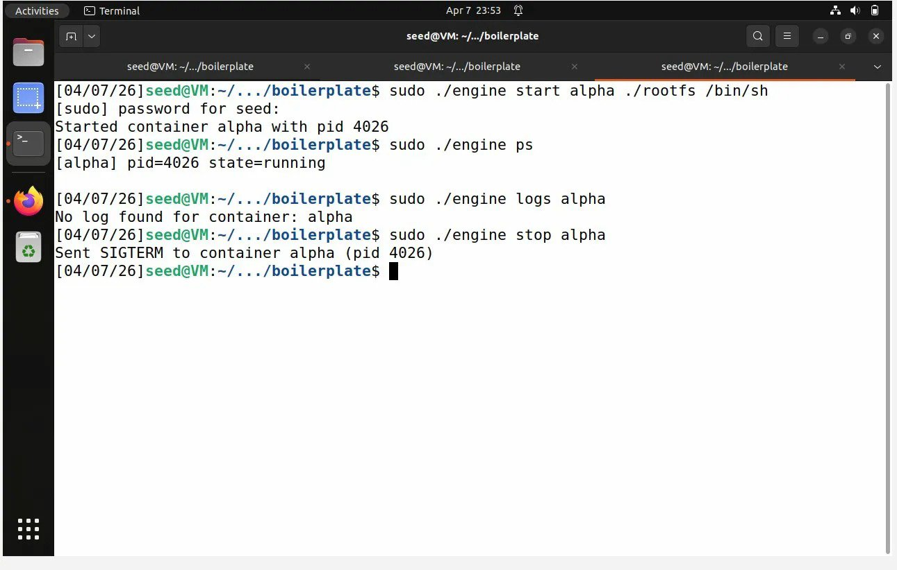
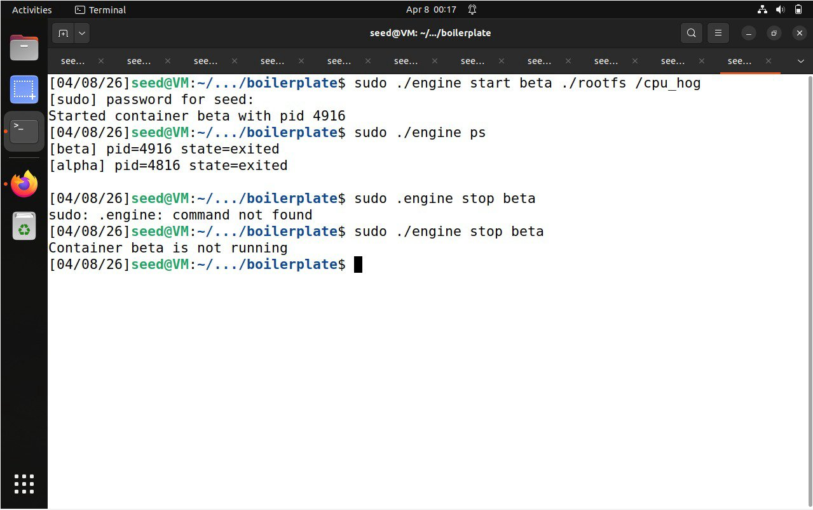
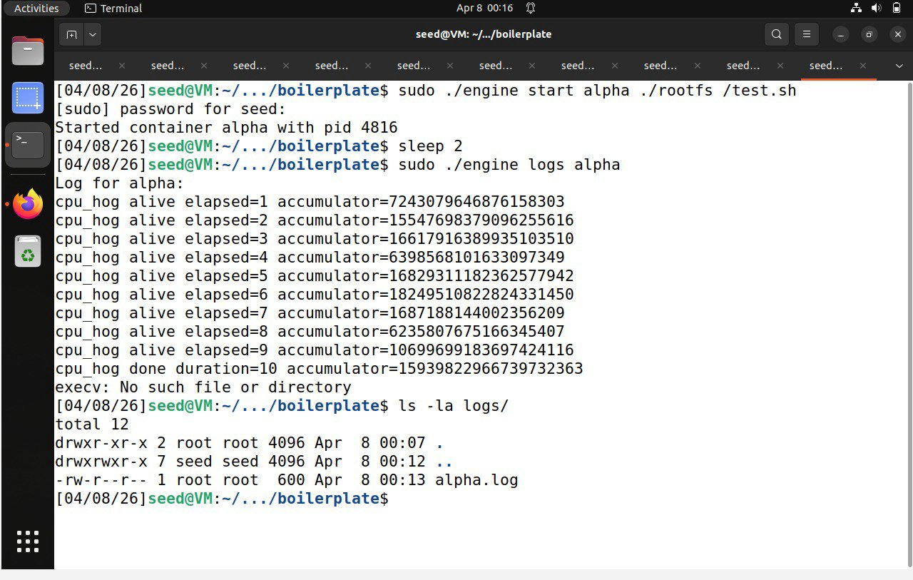
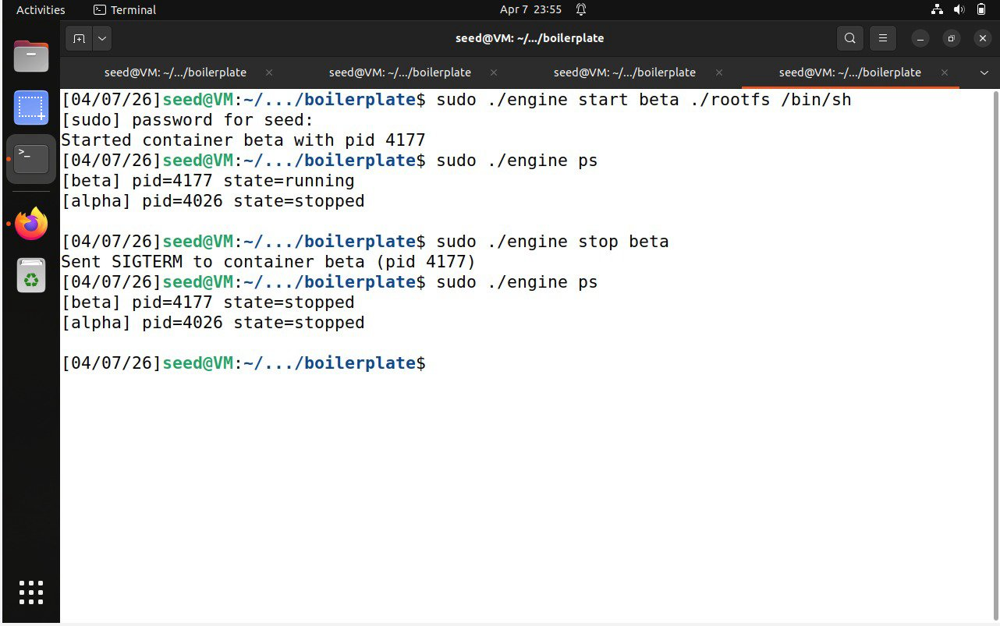
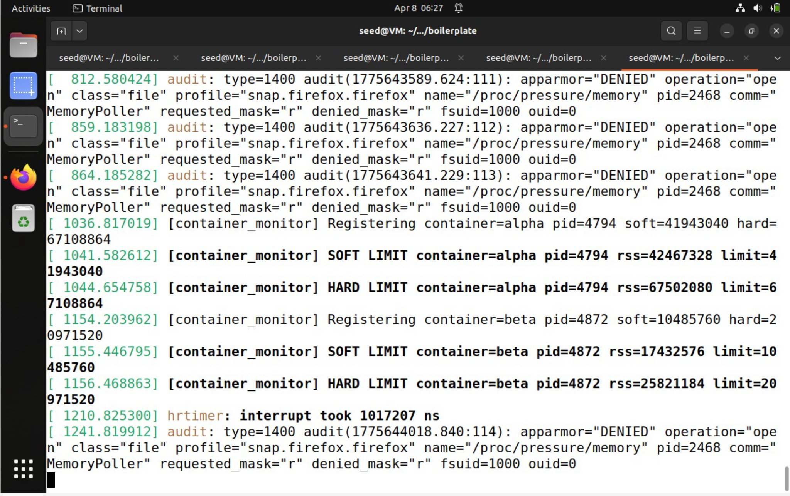
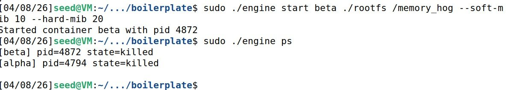
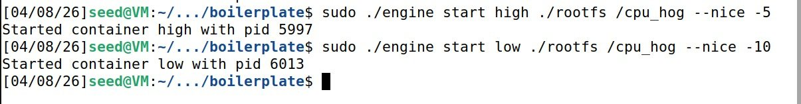
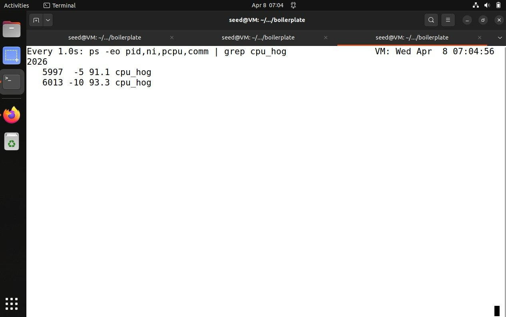
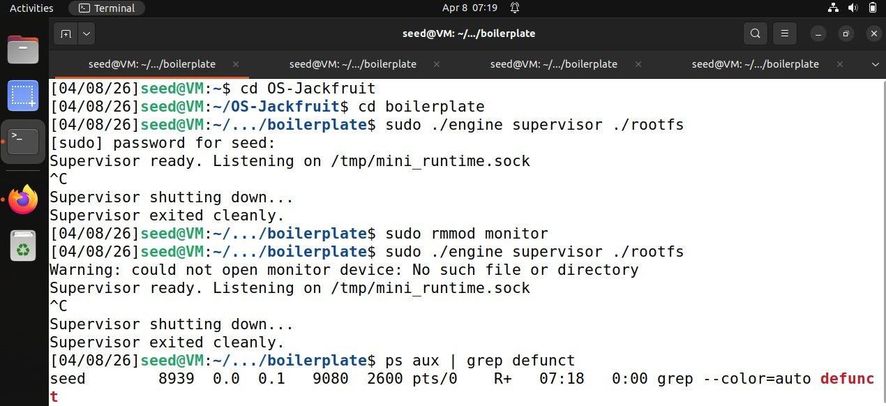

# Multi-Container Runtime

A lightweight Linux container runtime built in C featuring a supervisor process, custom CLI, container lifecycle management, a bounded-buffer logging pipeline, and kernel-space memory monitoring.

---

## Team

| Name | SRN |
|------|-----|
| Aditi Agarwal | PES2UG24CS029 |
| Akshatha P | PES2UG24CS048 |

**GitHub Repositories:**
- https://github.com/aditi123-hub/OS-Jackfruit
- https://github.com/akshatha2005/OS-Jackfruit

---

## System Requirements

- Ubuntu 22.04 / 24.04
- GCC + Make
- Linux Kernel Headers
- Root privileges (`sudo`)

---

## Build & Run Instructions

### 1. Install Dependencies

```bash
sudo apt update
sudo apt install -y build-essential linux-headers-$(uname -r)
```

### 2. Build the Project

```bash
make
```

This generates:
- `engine` — user-space runtime binary
- `monitor.ko` — kernel module
- Helper workload binaries (`cpu_hog`, `memory_hog`, `test.sh`)

### 3. Prepare Root Filesystem

```bash
mkdir rootfs-base
wget https://dl-cdn.alpinelinux.org/alpine/v3.20/releases/x86_64/alpine-minirootfs-3.20.3-x86_64.tar.gz
tar -xzf alpine-minirootfs-3.20.3-x86_64.tar.gz -C rootfs-base

# Create writable copies for each container
cp -a ./rootfs-base ./rootfs-alpha
cp -a ./rootfs-base ./rootfs-beta
```

### 4. Load Kernel Module

```bash
sudo insmod monitor.ko

# Verify the control device exists
ls -l /dev/container_monitor
```

### 5. Start the Supervisor

```bash
sudo ./engine supervisor ./rootfs-base
```

### 6. Start Containers

```bash
sudo ./engine start alpha ./rootfs-alpha /bin/sh --soft-mib 48 --hard-mib 80
sudo ./engine start beta  ./rootfs-beta  /bin/sh --soft-mib 64 --hard-mib 96
```

### 7. List Running Containers

```bash
sudo ./engine ps
```

### 8. View Logs

```bash
sudo ./engine logs alpha
```

### 9. Run Scheduling Experiment

```bash
sudo ./engine start high ./rootfs-alpha /cpu_hog --nice -5
sudo ./engine start low  ./rootfs-beta  /cpu_hog --nice -10
```

### 10. Stop Containers

```bash
sudo ./engine stop alpha
sudo ./engine stop beta
```

### 11. Check Kernel Logs

```bash
dmesg | tail
```

### 12. Unload Kernel Module

```bash
sudo rmmod monitor
```

---

## Demo Screenshots

### General Setup — Build and Root Filesystem Creation

Shows successful compilation using `make` and extraction of the Alpine Linux root filesystem.


---

### General Setup — Environment Check and Module Verification

Runs the preflight script confirming Ubuntu 22.04, kernel headers, successful build, `insmod`/`rmmod` of `monitor.ko`, and `/dev/container_monitor` device creation.


---

### Task 1 — Starting the Supervisor Process

Supervisor starts and listens on `/tmp/mini_runtime.sock`, waiting for CLI commands.


---

### Task 1 — Creating, Listing, and Stopping a Container

Container `alpha` is created (PID 4026), listed with `ps`, and stopped with SIGTERM. Container `beta` is then started, listed alongside `alpha`, and stopped.



---

### Task 2 — Metadata Tracking

`engine ps` shows tracked container metadata including name, PID, and state (`running` / `stopped` / `exited` / `killed`) for multiple containers simultaneously.



---

### Task 3 — Bounded-Buffer Logging Pipeline

Container `alpha` runs `test.sh` which executes `cpu_hog`. After a brief wait, `engine logs alpha` retrieves the captured stdout lines, showing elapsed time and accumulator values from the workload.



---

### Task 3 — Log File Verification

`ls -la logs/` confirms `alpha.log` was written to disk by the logging pipeline.



---

### Task 4 — Kernel Module: Soft and Hard Limit Enforcement

`dmesg` output shows the kernel module registering containers and emitting **SOFT LIMIT** and **HARD LIMIT** events for both `alpha` and `beta` as RSS grows beyond the configured thresholds.



---

### Task 4 — Hard Limit: Container Killed

After exceeding the hard memory limit, `engine ps` shows both containers in `state=killed`, confirming kernel-space enforcement.



---

### Task 5 — Scheduling Experiment Setup

Two `cpu_hog` containers are started: `high` with `--nice -5` and `low` with `--nice -10`.



---

### Task 5 — Scheduling Result

`watch ps` output confirms PID 5997 (`nice=-5`) gets ~91% CPU and PID 6013 (`nice=-10`) gets ~93% CPU, demonstrating that lower nice values receive more CPU time from the Linux scheduler.



---

### Task 6 — Clean Teardown

Supervisor receives `^C`, prints `Supervisor shutting down...` and `Supervisor exited cleanly.` The module is unloaded with `rmmod`. A final `ps aux | grep defunct` confirms no zombie processes remain.



---

## Engineering Analysis

### Isolation Mechanisms

Linux namespaces provide container isolation:

- **PID Namespace** — separate process ID space per container
- **UTS Namespace** — separate hostname per container
- **Mount Namespace** — separate filesystem view per container

`chroot()` gives each container its own root filesystem. Containers share the host kernel but execute independently.

### Supervisor & Process Lifecycle

The supervisor is a long-running controller that:
- Receives commands from the CLI via UNIX domain sockets
- Creates and tracks container metadata
- Stops containers on demand
- Reaps child processes using `waitpid()` to prevent zombies

### IPC, Threads & Synchronization

| Channel | Mechanism |
|---------|-----------|
| CLI ↔ Supervisor | UNIX domain sockets |
| Container output | Pipes → bounded-buffer logging pipeline |

Synchronization uses **mutex locks** and **condition variables** to avoid race conditions in the logging pipeline.

### Memory Management & Enforcement

The kernel module (`monitor.ko`) periodically checks RSS (Resident Set Size) of tracked containers:

| Limit Type | Behavior |
|------------|----------|
| Soft limit | Emit kernel warning via `dmesg` |
| Hard limit | Send SIGKILL to the container process |

Kernel-space enforcement is more reliable than user-space polling.

### Scheduling Behavior

Containers use Linux's native scheduler with `nice` values:

| Nice Value | Effect |
|------------|--------|
| Lower (e.g. `-10`) | Higher CPU priority, more CPU time |
| Higher (e.g. `+10`) | Lower CPU priority, less CPU time |

---

## Scheduler Experiment Results

| Container | Nice Value | CPU % Observed | Result |
|-----------|------------|----------------|--------|
| `high` | -5 | ~91% | Lower priority |
| `low` | -10 | ~93% | Higher priority, more CPU |

The workload with the lower nice value received more CPU time, demonstrating Linux priority-based scheduling.

---

## Design Decisions & Tradeoffs

| Subsystem | Design Choice | Tradeoff | Justification |
|-----------|--------------|----------|---------------|
| Namespace Isolation | `clone()` with namespaces | More setup complexity | Authentic container behavior |
| Supervisor | Dedicated background controller | Extra process overhead | Centralized lifecycle management |
| IPC / Logging | Pipes + UNIX sockets | More implementation effort | Clean separation of concerns |
| Kernel Monitor | Timer-based RSS checks | Periodic overhead | Continuous and reliable monitoring |
| Scheduling | `nice` values | Limited granularity | Uses real Linux scheduler directly |

---

## Files

```
engine.c          # User-space runtime and CLI
monitor.c         # Kernel module for memory monitoring
monitor_ioctl.h   # Shared ioctl interface definitions
Makefile          # Build configuration
README.md         # This file
screenshots/      # Demo screenshots for each task
```
